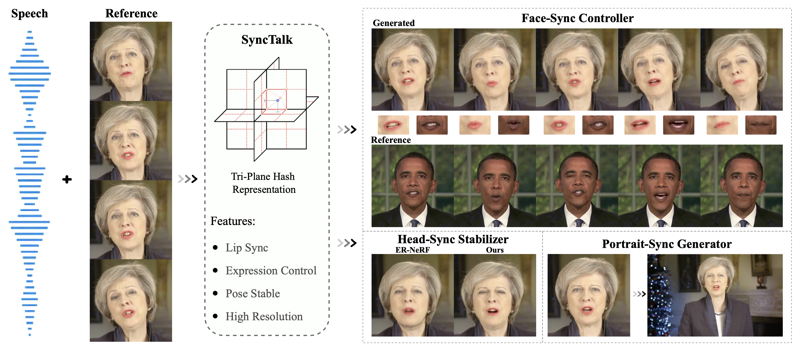

# SyncTalk
The official repository of the paper [SyncTalk: The Devil is in the Synchronization for Talking Head Synthesis](https://arxiv.org/abs/)

  <b>
    <a href="https://arxiv.org/abs/">Paper</a>
    | 
    <a href="https://ziqiaopeng.github.io/synctalk/">Project Page</a>
    |
    <a href="https://github.com/ZiqiaoPeng/SyncTalk">Code</a> 
  </b>

 
  
  
    
  

  The proposed **SyncTalk** synthesizes synchronized talking head videos, employing tri-plane hash representations to maintain subject identity. It can generate synchronized lip movements, facial expressions, and stable head poses, and restores hair details to create high-resolution videos.

  ## Code

We will release the code after the paper is accepted.

